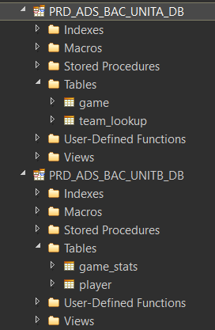

# teradata-dump-tpt

Dump Teradata database to files

## Setup

I am using a Teradata Express VM running on a Windows computer with Teradata Tool and Utilities installed.
I have created a couple of test databases populated with some test tables so we can demo this.



## Requirements

If we are dumping a whole database to a file system, we will want to retain all of the:

1. rows
2. table definitions
3. database hierachy

Maybe even views, stored procedures, roles, permissions etc, but this is goung to be out of scope

## Test with one table

You might want to get this working with just one test table first.

```ps1
.\dump.ps1
```

```log
Teradata Parallel Transporter Version 17.00.00.08 64-Bit
The global configuration file 'c:\program files\teradata\client\17.00\Teradata Parallel Transporter\twbcfg.ini' is used.
Log Directory: C:\Program Files\Teradata\client\17.00\Teradata Parallel Transporter/logs
Checkpoint Directory: C:\Program Files\Teradata\client\17.00\Teradata Parallel Transporter/checkpoint

Job log: C:\Program Files\Teradata\client\17.00\Teradata Parallel Transporter/logs/chris-268.out
Job id is chris-268, running on xpscold
Teradata Parallel Transporter Export Operator Version 17.00.00.08
$EXPORT: private log not specified
Teradata Parallel Transporter DataConnector Operator Version 17.00.00.08
$FILE_WRITER[1]: Instance 1 directing private log report to 'dtacop-chris-25332-1'.
$FILE_WRITER[1]: DataConnector Consumer operator Instances: 1
$FILE_WRITER[1]: ECI operator ID: '$FILE_WRITER-25332'
$FILE_WRITER[1]: Operator instance 1 processing file '.\\game.csv'.
$EXPORT: connecting sessions
$EXPORT: sending SELECT request
$EXPORT: entering End Export Phase
$EXPORT: Total Rows Exported:  266
$EXPORT: Total Rows Discarded: 0
$EXPORT: disconnecting sessions
$FILE_WRITER[1]: Total files processed: 1.
$EXPORT: Performance metrics:
$EXPORT:     MB/sec in Export phase: could not be determined
$EXPORT:     Elapsed time from start to Select phase:   4 second(s)
$EXPORT:     Elapsed time in Select phase: < 1 second
$EXPORT:     Elapsed time in Export phase: < 1 second
$EXPORT:     Elapsed time from Export phase to end:   3 second(s)
$EXPORT: Total processor time used = '0.046875 Second(s)'
$EXPORT: Start : Thu Sep 16 13:01:46 2021
$EXPORT: End   : Thu Sep 16 13:01:53 2021
Job step MAIN_STEP completed successfully
Job chris completed successfully
Job start: Thu Sep 16 13:01:46 2021
Job end:   Thu Sep 16 13:01:53 2021
```
